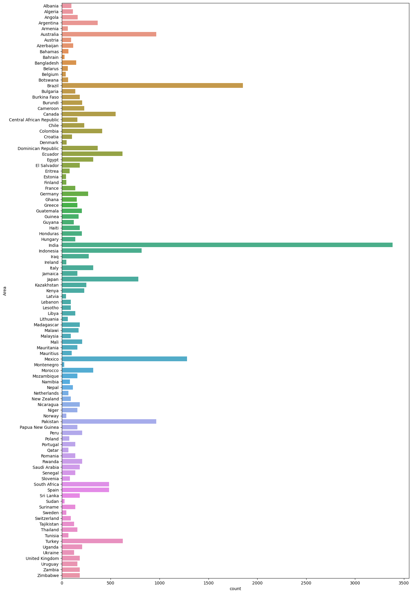
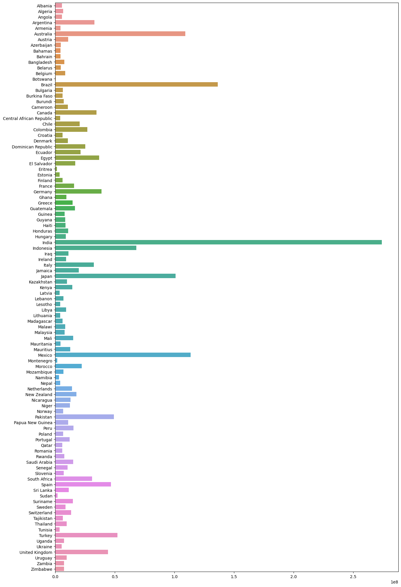
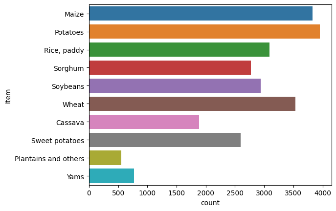
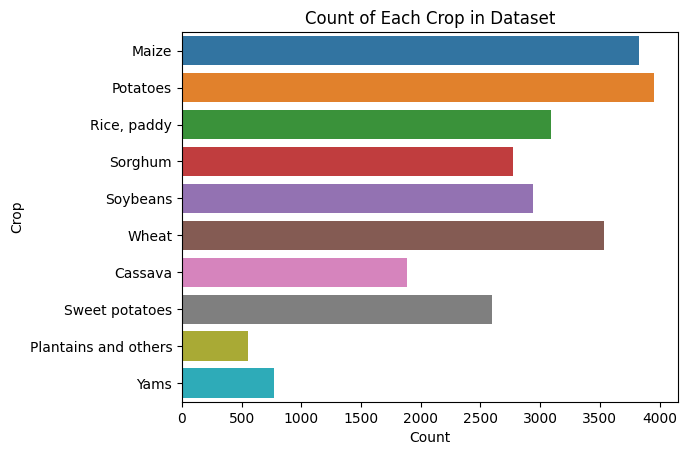
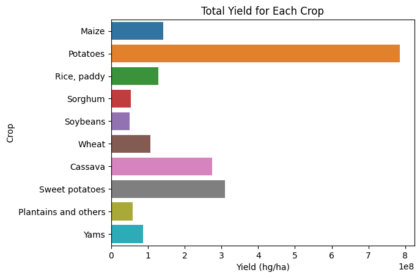
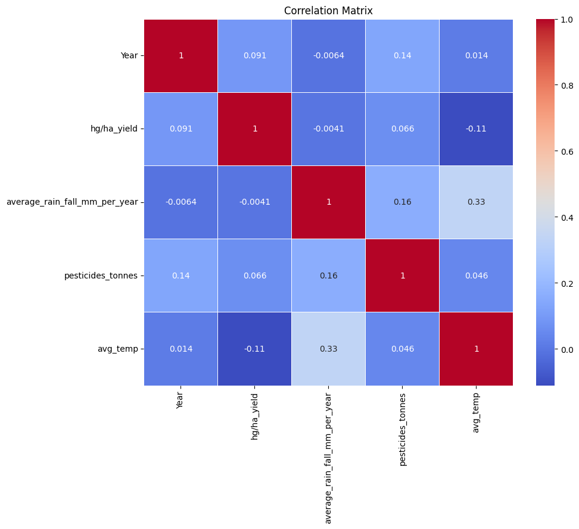
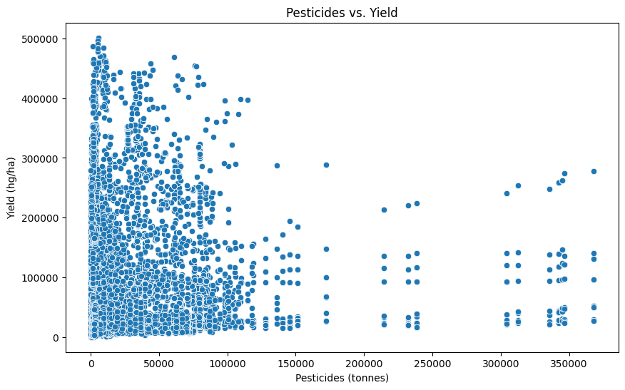
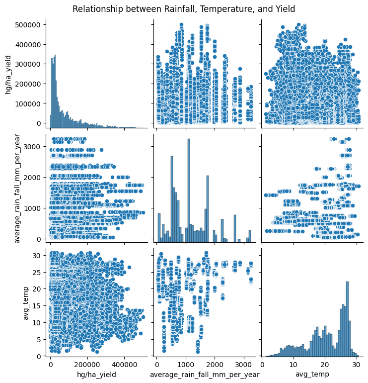
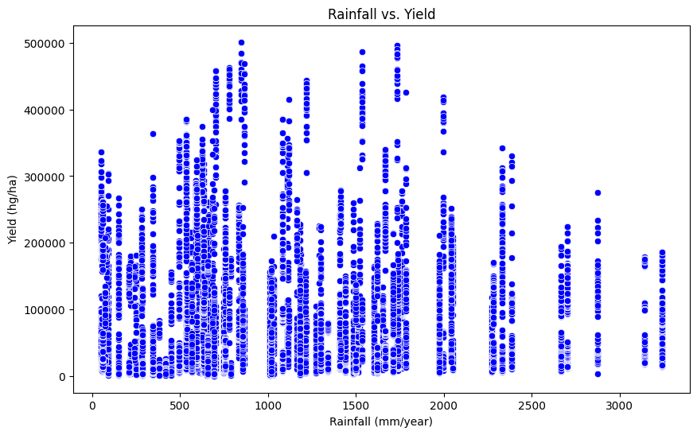
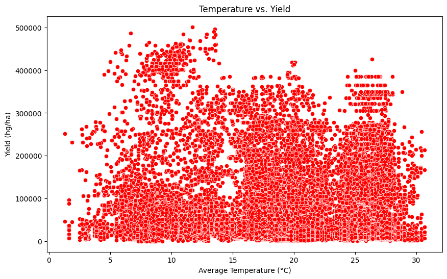

```python
import numpy as np
import pandas as pd
import matplotlib.pyplot as plt
import seaborn as sns
```


```python
df = pd.read_csv("yield_df.csv")
```

# Data Preprocessing and Cleaning


```python
df.head()
```


<div>
<style scoped>
    .dataframe tbody tr th:only-of-type {
        vertical-align: middle;
    }

    .dataframe tbody tr th {
        vertical-align: top;
    }

    .dataframe thead th {
        text-align: right;
    }
</style>
<table border="1" class="dataframe">
  <thead>
    <tr style="text-align: right;">
      <th></th>
      <th>Unnamed: 0</th>
      <th>Area</th>
      <th>Item</th>
      <th>Year</th>
      <th>hg/ha_yield</th>
      <th>average_rain_fall_mm_per_year</th>
      <th>pesticides_tonnes</th>
      <th>avg_temp</th>
    </tr>
  </thead>
  <tbody>
    <tr>
      <th>0</th>
      <td>0</td>
      <td>Albania</td>
      <td>Maize</td>
      <td>1990</td>
      <td>36613</td>
      <td>1485.0</td>
      <td>121.0</td>
      <td>16.37</td>
    </tr>
    <tr>
      <th>1</th>
      <td>1</td>
      <td>Albania</td>
      <td>Potatoes</td>
      <td>1990</td>
      <td>66667</td>
      <td>1485.0</td>
      <td>121.0</td>
      <td>16.37</td>
    </tr>
    <tr>
      <th>2</th>
      <td>2</td>
      <td>Albania</td>
      <td>Rice, paddy</td>
      <td>1990</td>
      <td>23333</td>
      <td>1485.0</td>
      <td>121.0</td>
      <td>16.37</td>
    </tr>
    <tr>
      <th>3</th>
      <td>3</td>
      <td>Albania</td>
      <td>Sorghum</td>
      <td>1990</td>
      <td>12500</td>
      <td>1485.0</td>
      <td>121.0</td>
      <td>16.37</td>
    </tr>
    <tr>
      <th>4</th>
      <td>4</td>
      <td>Albania</td>
      <td>Soybeans</td>
      <td>1990</td>
      <td>7000</td>
      <td>1485.0</td>
      <td>121.0</td>
      <td>16.37</td>
    </tr>
  </tbody>
</table>
</div>


I'm going to clean some columns that aren't needed. There's one called Unnamed:0


```python
df.drop('Unnamed: 0', axis = 1, inplace = True)
```


```python
df.head()
```


<div>
<style scoped>
    .dataframe tbody tr th:only-of-type {
        vertical-align: middle;
    }

    .dataframe tbody tr th {
        vertical-align: top;
    }

    .dataframe thead th {
        text-align: right;
    }
</style>
<table border="1" class="dataframe">
  <thead>
    <tr style="text-align: right;">
      <th></th>
      <th>Area</th>
      <th>Item</th>
      <th>Year</th>
      <th>hg/ha_yield</th>
      <th>average_rain_fall_mm_per_year</th>
      <th>pesticides_tonnes</th>
      <th>avg_temp</th>
    </tr>
  </thead>
  <tbody>
    <tr>
      <th>0</th>
      <td>Albania</td>
      <td>Maize</td>
      <td>1990</td>
      <td>36613</td>
      <td>1485.0</td>
      <td>121.0</td>
      <td>16.37</td>
    </tr>
    <tr>
      <th>1</th>
      <td>Albania</td>
      <td>Potatoes</td>
      <td>1990</td>
      <td>66667</td>
      <td>1485.0</td>
      <td>121.0</td>
      <td>16.37</td>
    </tr>
    <tr>
      <th>2</th>
      <td>Albania</td>
      <td>Rice, paddy</td>
      <td>1990</td>
      <td>23333</td>
      <td>1485.0</td>
      <td>121.0</td>
      <td>16.37</td>
    </tr>
    <tr>
      <th>3</th>
      <td>Albania</td>
      <td>Sorghum</td>
      <td>1990</td>
      <td>12500</td>
      <td>1485.0</td>
      <td>121.0</td>
      <td>16.37</td>
    </tr>
    <tr>
      <th>4</th>
      <td>Albania</td>
      <td>Soybeans</td>
      <td>1990</td>
      <td>7000</td>
      <td>1485.0</td>
      <td>121.0</td>
      <td>16.37</td>
    </tr>
  </tbody>
</table>
</div>


```python
df_original_shape = df.shape
print(df_original_shape)
```

    (28242, 7)
    


```python
#After dropping values, it's a good idea to reset the indexes:
df.reset_index(drop=True, inplace=True)
```


```python
df.isnull().sum()
```


    Area                             0
    Item                             0
    Year                             0
    hg/ha_yield                      0
    average_rain_fall_mm_per_year    0
    pesticides_tonnes                0
    avg_temp                         0
    dtype: int64


```python
df.info()
```

    <class 'pandas.core.frame.DataFrame'>
    RangeIndex: 28242 entries, 0 to 28241
    Data columns (total 7 columns):
     #   Column                         Non-Null Count  Dtype  
    ---  ------                         --------------  -----  
     0   Area                           28242 non-null  object 
     1   Item                           28242 non-null  object 
     2   Year                           28242 non-null  int64  
     3   hg/ha_yield                    28242 non-null  int64  
     4   average_rain_fall_mm_per_year  28242 non-null  float64
     5   pesticides_tonnes              28242 non-null  float64
     6   avg_temp                       28242 non-null  float64
    dtypes: float64(3), int64(2), object(2)
    memory usage: 1.5+ MB
    


```python
#check to see if there are any duplicated values and drop them if there is
df.duplicated().sum()
```


    2310


```python
df.drop_duplicates(inplace = True)
```


```python
df.duplicated().sum()
```


    0


### Data Transformation: 
To proceed with the prediction, we need to identify the columns/variables that are needed for the functions.
One of them is the average_rain_fall_mm_per_year. We need to first make sure that the values in this column are numeric values and not numeric strings.

Let's see what the statistics says about this dataset first:


```python
df.describe()
```


<div>
<style scoped>
    .dataframe tbody tr th:only-of-type {
        vertical-align: middle;
    }

    .dataframe tbody tr th {
        vertical-align: top;
    }

    .dataframe thead th {
        text-align: right;
    }
</style>
<table border="1" class="dataframe">
  <thead>
    <tr style="text-align: right;">
      <th></th>
      <th>Year</th>
      <th>hg/ha_yield</th>
      <th>average_rain_fall_mm_per_year</th>
      <th>pesticides_tonnes</th>
      <th>avg_temp</th>
    </tr>
  </thead>
  <tbody>
    <tr>
      <th>count</th>
      <td>25932.000000</td>
      <td>25932.000000</td>
      <td>25932.000000</td>
      <td>25932.000000</td>
      <td>25932.000000</td>
    </tr>
    <tr>
      <th>mean</th>
      <td>2001.556455</td>
      <td>76978.132925</td>
      <td>1146.836688</td>
      <td>34782.573241</td>
      <td>20.422251</td>
    </tr>
    <tr>
      <th>std</th>
      <td>7.055924</td>
      <td>84647.605552</td>
      <td>717.391098</td>
      <td>57228.568244</td>
      <td>6.439402</td>
    </tr>
    <tr>
      <th>min</th>
      <td>1990.000000</td>
      <td>50.000000</td>
      <td>51.000000</td>
      <td>0.040000</td>
      <td>1.300000</td>
    </tr>
    <tr>
      <th>25%</th>
      <td>1995.000000</td>
      <td>19996.000000</td>
      <td>593.000000</td>
      <td>1597.000000</td>
      <td>16.580000</td>
    </tr>
    <tr>
      <th>50%</th>
      <td>2001.000000</td>
      <td>39530.000000</td>
      <td>1083.000000</td>
      <td>15373.000000</td>
      <td>21.420000</td>
    </tr>
    <tr>
      <th>75%</th>
      <td>2008.000000</td>
      <td>104168.000000</td>
      <td>1668.000000</td>
      <td>45620.000000</td>
      <td>26.060000</td>
    </tr>
    <tr>
      <th>max</th>
      <td>2013.000000</td>
      <td>501412.000000</td>
      <td>3240.000000</td>
      <td>367778.000000</td>
      <td>30.650000</td>
    </tr>
  </tbody>
</table>
</div>


__Now I'll proceed with checking for numeric strings__


```python
df['average_rain_fall_mm_per_year']
```


    0        1485.0
    1        1485.0
    2        1485.0
    3        1485.0
    4        1485.0
              ...  
    28237     657.0
    28238     657.0
    28239     657.0
    28240     657.0
    28241     657.0
    Name: average_rain_fall_mm_per_year, Length: 25932, dtype: float64


```python
#Let's define a function to check is an object can be converted to a float
def isString(obj):
    try:
        float(obj)
        return False
    except:
        return True
```


```python
dropping_values = df[df['average_rain_fall_mm_per_year'].apply(isString)].index
print(dropping_values)
```

    Int64Index([], dtype='int64')
    


```python
df = df.drop(dropping_values)
```


```python
dropped_shape = df.shape
print(dropped_shape)
```

    (25932, 7)
    


```python
#Check to see the number of rows dropped:
number_dropped = df_original_shape[0] - dropped_shape[0]
print(number_dropped)
```

    2310
    

# Visualizing Variables
Now I'm going to plot the graphs to see the relationships between variables. I'll start with Country vs Frequency to see the number of times each country appeared in the dataset. 

## Frequency-Area Plot


```python
#Let's scale the plot 15 by 25 inches.
plt.figure(figsize = (15,25)) 
sns.countplot(y = df['Area'])
```


    <Axes: xlabel='count', ylabel='Area'>


    

    


## Yield Per Country

Since the data labeled the country names as 'Area', I'm goign to first change this:


```python
country = df['Area'].unique()
```


```python
yield_per_country = []
for state in country:
    yield_per_country.append(df[df['Area'] == state]['hg/ha_yield'].sum())
```

df['hg/ha_yield'] is all the countries' values for their specific crop
And now we have appended values for yield PER country: 


```python
yield_per_country
```


    [5711536,
     6711464,
     5722563,
     32864032,
     4524100,
     109111062,
     10852258,
     4608380,
     4384717,
     4443889,
     7720159,
     4704812,
     8442270,
     470651,
     136340329,
     6263075,
     6083337,
     7031146,
     10717883,
     34706922,
     4255627,
     20561214,
     26927138,
     6083167,
     10701651,
     25312166,
     21315591,
     36828848,
     16855944,
     1452416,
     3595638,
     6210668,
     15790618,
     38780463,
     9260371,
     14571925,
     16508723,
     7975743,
     8361103,
     8619194,
     10920131,
     8824110,
     274219558,
     68067328,
     10984722,
     9104030,
     32280700,
     19698007,
     100924145,
     9965212,
     14391737,
     3698588,
     6956804,
     4258932,
     9016288,
     4174348,
     6103523,
     8346715,
     7934982,
     15106720,
     4465841,
     12684212,
     113698872,
     1645100,
     22173010,
     6964027,
     3165475,
     4113713,
     14086433,
     17657728,
     12819227,
     12316327,
     6721305,
     49264956,
     10729929,
     15201910,
     6564711,
     12154347,
     5995626,
     6006156,
     7741053,
     15171886,
     10342677,
     7197013,
     30999849,
     46773540,
     11217741,
     1896346,
     14786468,
     8620653,
     13336346,
     6295210,
     9511720,
     3724246,
     52263950,
     7494314,
     5496901,
     44335992,
     9539820,
     7254311,
     7408629]


```python
#Plotting Yield per Country
plt.figure(figsize = (15,25))
sns.barplot(y = country, x = yield_per_country)
```


    <Axes: >


    

    


```python
df['Item'].value_counts()
```


    Potatoes                3956
    Maize                   3824
    Wheat                   3539
    Rice, paddy             3091
    Soybeans                2940
    Sorghum                 2770
    Sweet potatoes          2593
    Cassava                 1889
    Yams                     774
    Plantains and others     556
    Name: Item, dtype: int64


```python
sns.countplot(y = df['Item'])
```


    <Axes: xlabel='count', ylabel='Item'>


    

    


# Yield and Item Plot


```python
crops = df['Item'].unique()
crops
```


    array(['Maize', 'Potatoes', 'Rice, paddy', 'Sorghum', 'Soybeans', 'Wheat',
           'Cassava', 'Sweet potatoes', 'Plantains and others', 'Yams'],
          dtype=object)


```python
#Doing the same thing for yield_per_item as we did in yield_per_country:
yield_per_crop = []
for c in crops:
    yield_per_crop.append(df[df['Item'] == c]['hg/ha_yield'].sum())
```


```python
#Values for yield per crop
yield_per_crop
```


    [142020761,
     785921609,
     127646024,
     52906376,
     49957039,
     106614786,
     275132269,
     310269345,
     58958974,
     86769760]


```python
sns.countplot(y=df['Item'])
plt.title('Count of Each Crop in Dataset')
plt.xlabel('Count')
plt.ylabel('Crop')
plt.show()
```


    

    


```python
sns.barplot(y=crops, x=yield_per_crop)
plt.title('Total Yield for Each Crop')
plt.xlabel('Yield (hg/ha)')
plt.ylabel('Crop')
plt.show()
```


    

    


# Correlation Heatmaps


```python
corr_matrix = df.corr()
plt.figure(figsize=(10,8))
sns.heatmap(corr_matrix, annot=True, cmap="coolwarm", linewidths=0.5)
plt.title("Correlation Matrix")
plt.show()

```

    C:\Users\mtmic\AppData\Local\Temp\ipykernel_30136\337088734.py:1: FutureWarning: The default value of numeric_only in DataFrame.corr is deprecated. In a future version, it will default to False. Select only valid columns or specify the value of numeric_only to silence this warning.
      corr_matrix = df.corr()
    


    

    


# Pesticides vs Yield


```python
plt.figure(figsize=(10,6))
sns.scatterplot(x='pesticides_tonnes', y='hg/ha_yield', data=df)
plt.title("Pesticides vs. Yield")
plt.xlabel("Pesticides (tonnes)")
plt.ylabel("Yield (hg/ha)")
plt.show()

```


    

    


## Temperature and Rainfall vs. Yield


```python
# Pairplot for a subset of the data
sns.pairplot(df[['hg/ha_yield', 'average_rain_fall_mm_per_year', 'avg_temp']])
plt.suptitle("Relationship between Rainfall, Temperature, and Yield", y=1.02)
plt.show()

# Scatter plot specifically for Rainfall vs. Yield
plt.figure(figsize=(10,6))
sns.scatterplot(x='average_rain_fall_mm_per_year', y='hg/ha_yield', data=df, color='blue')
plt.title("Rainfall vs. Yield")
plt.xlabel("Rainfall (mm/year)")
plt.ylabel("Yield (hg/ha)")
plt.show()

# Scatter plot specifically for Temperature vs. Yield
plt.figure(figsize=(10,6))
sns.scatterplot(x='avg_temp', y='hg/ha_yield', data=df, color='red')
plt.title("Temperature vs. Yield")
plt.xlabel("Average Temperature (°C)")
plt.ylabel("Yield (hg/ha)")
plt.show()

```

    C:\Users\mtmic\anaconda3\lib\site-packages\seaborn\axisgrid.py:118: UserWarning: The figure layout has changed to tight
      self._figure.tight_layout(*args, **kwargs)
    


    

    


    

    


    

    


```python

```

# Train, Test, Split and Rearranging Columns

Here's the step of what I will be doing:
1. The columns that will be used for modeling are selected and reordered.
1. The DataFrame df is then separated into features (X) and target (y).
1. The data is split into training and testing sets using the train_test_split function from scikit-learn. The split is such that 20% of the data will be used for testing, and 80% for training. The random_state=42 ensures reproducibility of results.


```python
col = ['Year', 'average_rain_fall_mm_per_year','pesticides_tonnes', 'avg_temp', 'Area', 'Item', 'hg/ha_yield']
df = df[col]
X = df.iloc[:, :-1]
y = df.iloc[:, -1]
```


```python
from sklearn.model_selection import train_test_split
```


```python
train_test_split
```


    <function sklearn.model_selection._split.train_test_split(*arrays, test_size=None, train_size=None, random_state=None, shuffle=True, stratify=None)>


```python
X_train, X_test, y_train, y_test = train_test_split(X, y, test_size=0.2, random_state=42)
```


```python
X_train.shape
```


    (20745, 6)


```python
X_test.shape
```


    (5187, 6)


```python
X_train
```


<div>
<style scoped>
    .dataframe tbody tr th:only-of-type {
        vertical-align: middle;
    }

    .dataframe tbody tr th {
        vertical-align: top;
    }

    .dataframe thead th {
        text-align: right;
    }
</style>
<table border="1" class="dataframe">
  <thead>
    <tr style="text-align: right;">
      <th></th>
      <th>Year</th>
      <th>average_rain_fall_mm_per_year</th>
      <th>pesticides_tonnes</th>
      <th>avg_temp</th>
      <th>Area</th>
      <th>Item</th>
    </tr>
  </thead>
  <tbody>
    <tr>
      <th>24234</th>
      <td>2000</td>
      <td>59.0</td>
      <td>3024.11</td>
      <td>26.55</td>
      <td>Saudi Arabia</td>
      <td>Sorghum</td>
    </tr>
    <tr>
      <th>9468</th>
      <td>2012</td>
      <td>652.0</td>
      <td>8002.20</td>
      <td>18.82</td>
      <td>Greece</td>
      <td>Sweet potatoes</td>
    </tr>
    <tr>
      <th>6793</th>
      <td>2006</td>
      <td>3240.0</td>
      <td>98328.63</td>
      <td>27.51</td>
      <td>Colombia</td>
      <td>Maize</td>
    </tr>
    <tr>
      <th>28212</th>
      <td>2010</td>
      <td>657.0</td>
      <td>3305.17</td>
      <td>21.17</td>
      <td>Zimbabwe</td>
      <td>Potatoes</td>
    </tr>
    <tr>
      <th>7358</th>
      <td>2007</td>
      <td>1410.0</td>
      <td>5689.80</td>
      <td>27.08</td>
      <td>Dominican Republic</td>
      <td>Sweet potatoes</td>
    </tr>
    <tr>
      <th>...</th>
      <td>...</td>
      <td>...</td>
      <td>...</td>
      <td>...</td>
      <td>...</td>
      <td>...</td>
    </tr>
    <tr>
      <th>23678</th>
      <td>2004</td>
      <td>854.0</td>
      <td>16942.00</td>
      <td>16.31</td>
      <td>Portugal</td>
      <td>Sweet potatoes</td>
    </tr>
    <tr>
      <th>5960</th>
      <td>2006</td>
      <td>537.0</td>
      <td>36572.75</td>
      <td>7.85</td>
      <td>Canada</td>
      <td>Wheat</td>
    </tr>
    <tr>
      <th>860</th>
      <td>1991</td>
      <td>534.0</td>
      <td>17866.00</td>
      <td>18.73</td>
      <td>Australia</td>
      <td>Potatoes</td>
    </tr>
    <tr>
      <th>17223</th>
      <td>1998</td>
      <td>250.0</td>
      <td>6416.14</td>
      <td>6.94</td>
      <td>Kazakhstan</td>
      <td>Potatoes</td>
    </tr>
    <tr>
      <th>25918</th>
      <td>1994</td>
      <td>2331.0</td>
      <td>178.50</td>
      <td>26.82</td>
      <td>Suriname</td>
      <td>Cassava</td>
    </tr>
  </tbody>
</table>
<p>20745 rows × 6 columns</p>
</div>


# Converting Categorical to Numerical and Scaling the values


Now we are going to prepare the data for machine learning. 
Specifically:
Splitting data into training and testing sets allows for the evaluation of model performance on unseen data.
Converting categorical variables into a numerical format allows them to be used in many machine learning models that require numerical input data.
Scaling the numeric features is often necessary for algorithms that are sensitive to the scale of the input features, such as linear models or models using gradient descent.


```python
from sklearn.preprocessing import OneHotEncoder
from sklearn.compose import ColumnTransformer
```


```python
X_train.head(1)
```


<div>
<style scoped>
    .dataframe tbody tr th:only-of-type {
        vertical-align: middle;
    }

    .dataframe tbody tr th {
        vertical-align: top;
    }

    .dataframe thead th {
        text-align: right;
    }
</style>
<table border="1" class="dataframe">
  <thead>
    <tr style="text-align: right;">
      <th></th>
      <th>Year</th>
      <th>average_rain_fall_mm_per_year</th>
      <th>pesticides_tonnes</th>
      <th>avg_temp</th>
      <th>Area</th>
      <th>Item</th>
    </tr>
  </thead>
  <tbody>
    <tr>
      <th>24234</th>
      <td>2000</td>
      <td>59.0</td>
      <td>3024.11</td>
      <td>26.55</td>
      <td>Saudi Arabia</td>
      <td>Sorghum</td>
    </tr>
  </tbody>
</table>
</div>


```python
ohe = OneHotEncoder(drop = 'first')
scaler = StandardScaler()
```


```python
preprocessor = ColumnTransformer(
    transformers = [
        ('onehotencoder', ohe, [4,5]), #Area and Item index is 4 and 5
        ('standardization', scaler, [0,1,2,3])
    ],
    remainder = 'passthrough'
)
    
        
```


```python
preprocessor
```


<style>#sk-container-id-2 {color: black;background-color: white;}#sk-container-id-2 pre{padding: 0;}#sk-container-id-2 div.sk-toggleable {background-color: white;}#sk-container-id-2 label.sk-toggleable__label {cursor: pointer;display: block;width: 100%;margin-bottom: 0;padding: 0.3em;box-sizing: border-box;text-align: center;}#sk-container-id-2 label.sk-toggleable__label-arrow:before {content: "▸";float: left;margin-right: 0.25em;color: #696969;}#sk-container-id-2 label.sk-toggleable__label-arrow:hover:before {color: black;}#sk-container-id-2 div.sk-estimator:hover label.sk-toggleable__label-arrow:before {color: black;}#sk-container-id-2 div.sk-toggleable__content {max-height: 0;max-width: 0;overflow: hidden;text-align: left;background-color: #f0f8ff;}#sk-container-id-2 div.sk-toggleable__content pre {margin: 0.2em;color: black;border-radius: 0.25em;background-color: #f0f8ff;}#sk-container-id-2 input.sk-toggleable__control:checked~div.sk-toggleable__content {max-height: 200px;max-width: 100%;overflow: auto;}#sk-container-id-2 input.sk-toggleable__control:checked~label.sk-toggleable__label-arrow:before {content: "▾";}#sk-container-id-2 div.sk-estimator input.sk-toggleable__control:checked~label.sk-toggleable__label {background-color: #d4ebff;}#sk-container-id-2 div.sk-label input.sk-toggleable__control:checked~label.sk-toggleable__label {background-color: #d4ebff;}#sk-container-id-2 input.sk-hidden--visually {border: 0;clip: rect(1px 1px 1px 1px);clip: rect(1px, 1px, 1px, 1px);height: 1px;margin: -1px;overflow: hidden;padding: 0;position: absolute;width: 1px;}#sk-container-id-2 div.sk-estimator {font-family: monospace;background-color: #f0f8ff;border: 1px dotted black;border-radius: 0.25em;box-sizing: border-box;margin-bottom: 0.5em;}#sk-container-id-2 div.sk-estimator:hover {background-color: #d4ebff;}#sk-container-id-2 div.sk-parallel-item::after {content: "";width: 100%;border-bottom: 1px solid gray;flex-grow: 1;}#sk-container-id-2 div.sk-label:hover label.sk-toggleable__label {background-color: #d4ebff;}#sk-container-id-2 div.sk-serial::before {content: "";position: absolute;border-left: 1px solid gray;box-sizing: border-box;top: 0;bottom: 0;left: 50%;z-index: 0;}#sk-container-id-2 div.sk-serial {display: flex;flex-direction: column;align-items: center;background-color: white;padding-right: 0.2em;padding-left: 0.2em;position: relative;}#sk-container-id-2 div.sk-item {position: relative;z-index: 1;}#sk-container-id-2 div.sk-parallel {display: flex;align-items: stretch;justify-content: center;background-color: white;position: relative;}#sk-container-id-2 div.sk-item::before, #sk-container-id-2 div.sk-parallel-item::before {content: "";position: absolute;border-left: 1px solid gray;box-sizing: border-box;top: 0;bottom: 0;left: 50%;z-index: -1;}#sk-container-id-2 div.sk-parallel-item {display: flex;flex-direction: column;z-index: 1;position: relative;background-color: white;}#sk-container-id-2 div.sk-parallel-item:first-child::after {align-self: flex-end;width: 50%;}#sk-container-id-2 div.sk-parallel-item:last-child::after {align-self: flex-start;width: 50%;}#sk-container-id-2 div.sk-parallel-item:only-child::after {width: 0;}#sk-container-id-2 div.sk-dashed-wrapped {border: 1px dashed gray;margin: 0 0.4em 0.5em 0.4em;box-sizing: border-box;padding-bottom: 0.4em;background-color: white;}#sk-container-id-2 div.sk-label label {font-family: monospace;font-weight: bold;display: inline-block;line-height: 1.2em;}#sk-container-id-2 div.sk-label-container {text-align: center;}#sk-container-id-2 div.sk-container {/* jupyter's `normalize.less` sets `[hidden] { display: none; }` but bootstrap.min.css set `[hidden] { display: none !important; }` so we also need the `!important` here to be able to override the default hidden behavior on the sphinx rendered scikit-learn.org. See: https://github.com/scikit-learn/scikit-learn/issues/21755 */display: inline-block !important;position: relative;}#sk-container-id-2 div.sk-text-repr-fallback {display: none;}</style><div id="sk-container-id-2" class="sk-top-container"><div class="sk-text-repr-fallback"><pre>ColumnTransformer(remainder=&#x27;passthrough&#x27;,
                  transformers=[(&#x27;onehotencoder&#x27;, OneHotEncoder(drop=&#x27;first&#x27;),
                                 [4, 5]),
                                (&#x27;standardization&#x27;, StandardScaler(),
                                 [0, 1, 2, 3])])</pre><b>In a Jupyter environment, please rerun this cell to show the HTML representation or trust the notebook. <br />On GitHub, the HTML representation is unable to render, please try loading this page with nbviewer.org.</b></div><div class="sk-container" hidden><div class="sk-item sk-dashed-wrapped"><div class="sk-label-container"><div class="sk-label sk-toggleable"><input class="sk-toggleable__control sk-hidden--visually" id="sk-estimator-id-8" type="checkbox" ><label for="sk-estimator-id-8" class="sk-toggleable__label sk-toggleable__label-arrow">ColumnTransformer</label><div class="sk-toggleable__content"><pre>ColumnTransformer(remainder=&#x27;passthrough&#x27;,
                  transformers=[(&#x27;onehotencoder&#x27;, OneHotEncoder(drop=&#x27;first&#x27;),
                                 [4, 5]),
                                (&#x27;standardization&#x27;, StandardScaler(),
                                 [0, 1, 2, 3])])</pre></div></div></div><div class="sk-parallel"><div class="sk-parallel-item"><div class="sk-item"><div class="sk-label-container"><div class="sk-label sk-toggleable"><input class="sk-toggleable__control sk-hidden--visually" id="sk-estimator-id-9" type="checkbox" ><label for="sk-estimator-id-9" class="sk-toggleable__label sk-toggleable__label-arrow">onehotencoder</label><div class="sk-toggleable__content"><pre>[4, 5]</pre></div></div></div><div class="sk-serial"><div class="sk-item"><div class="sk-estimator sk-toggleable"><input class="sk-toggleable__control sk-hidden--visually" id="sk-estimator-id-10" type="checkbox" ><label for="sk-estimator-id-10" class="sk-toggleable__label sk-toggleable__label-arrow">OneHotEncoder</label><div class="sk-toggleable__content"><pre>OneHotEncoder(drop=&#x27;first&#x27;)</pre></div></div></div></div></div></div><div class="sk-parallel-item"><div class="sk-item"><div class="sk-label-container"><div class="sk-label sk-toggleable"><input class="sk-toggleable__control sk-hidden--visually" id="sk-estimator-id-11" type="checkbox" ><label for="sk-estimator-id-11" class="sk-toggleable__label sk-toggleable__label-arrow">standardization</label><div class="sk-toggleable__content"><pre>[0, 1, 2, 3]</pre></div></div></div><div class="sk-serial"><div class="sk-item"><div class="sk-estimator sk-toggleable"><input class="sk-toggleable__control sk-hidden--visually" id="sk-estimator-id-12" type="checkbox" ><label for="sk-estimator-id-12" class="sk-toggleable__label sk-toggleable__label-arrow">StandardScaler</label><div class="sk-toggleable__content"><pre>StandardScaler()</pre></div></div></div></div></div></div><div class="sk-parallel-item"><div class="sk-item"><div class="sk-label-container"><div class="sk-label sk-toggleable"><input class="sk-toggleable__control sk-hidden--visually" id="sk-estimator-id-13" type="checkbox" ><label for="sk-estimator-id-13" class="sk-toggleable__label sk-toggleable__label-arrow">remainder</label><div class="sk-toggleable__content"><pre></pre></div></div></div><div class="sk-serial"><div class="sk-item"><div class="sk-estimator sk-toggleable"><input class="sk-toggleable__control sk-hidden--visually" id="sk-estimator-id-14" type="checkbox" ><label for="sk-estimator-id-14" class="sk-toggleable__label sk-toggleable__label-arrow">passthrough</label><div class="sk-toggleable__content"><pre>passthrough</pre></div></div></div></div></div></div></div></div></div></div>


```python
X_train_dummy = preprocessor.fit_transform(X_train)
X_test_dummy = preprocessor.transform(X_test)
```


```python
X_train
```


<div>
<style scoped>
    .dataframe tbody tr th:only-of-type {
        vertical-align: middle;
    }

    .dataframe tbody tr th {
        vertical-align: top;
    }

    .dataframe thead th {
        text-align: right;
    }
</style>
<table border="1" class="dataframe">
  <thead>
    <tr style="text-align: right;">
      <th></th>
      <th>Year</th>
      <th>average_rain_fall_mm_per_year</th>
      <th>pesticides_tonnes</th>
      <th>avg_temp</th>
      <th>Area</th>
      <th>Item</th>
    </tr>
  </thead>
  <tbody>
    <tr>
      <th>24234</th>
      <td>2000</td>
      <td>59.0</td>
      <td>3024.11</td>
      <td>26.55</td>
      <td>Saudi Arabia</td>
      <td>Sorghum</td>
    </tr>
    <tr>
      <th>9468</th>
      <td>2012</td>
      <td>652.0</td>
      <td>8002.20</td>
      <td>18.82</td>
      <td>Greece</td>
      <td>Sweet potatoes</td>
    </tr>
    <tr>
      <th>6793</th>
      <td>2006</td>
      <td>3240.0</td>
      <td>98328.63</td>
      <td>27.51</td>
      <td>Colombia</td>
      <td>Maize</td>
    </tr>
    <tr>
      <th>28212</th>
      <td>2010</td>
      <td>657.0</td>
      <td>3305.17</td>
      <td>21.17</td>
      <td>Zimbabwe</td>
      <td>Potatoes</td>
    </tr>
    <tr>
      <th>7358</th>
      <td>2007</td>
      <td>1410.0</td>
      <td>5689.80</td>
      <td>27.08</td>
      <td>Dominican Republic</td>
      <td>Sweet potatoes</td>
    </tr>
    <tr>
      <th>...</th>
      <td>...</td>
      <td>...</td>
      <td>...</td>
      <td>...</td>
      <td>...</td>
      <td>...</td>
    </tr>
    <tr>
      <th>23678</th>
      <td>2004</td>
      <td>854.0</td>
      <td>16942.00</td>
      <td>16.31</td>
      <td>Portugal</td>
      <td>Sweet potatoes</td>
    </tr>
    <tr>
      <th>5960</th>
      <td>2006</td>
      <td>537.0</td>
      <td>36572.75</td>
      <td>7.85</td>
      <td>Canada</td>
      <td>Wheat</td>
    </tr>
    <tr>
      <th>860</th>
      <td>1991</td>
      <td>534.0</td>
      <td>17866.00</td>
      <td>18.73</td>
      <td>Australia</td>
      <td>Potatoes</td>
    </tr>
    <tr>
      <th>17223</th>
      <td>1998</td>
      <td>250.0</td>
      <td>6416.14</td>
      <td>6.94</td>
      <td>Kazakhstan</td>
      <td>Potatoes</td>
    </tr>
    <tr>
      <th>25918</th>
      <td>1994</td>
      <td>2331.0</td>
      <td>178.50</td>
      <td>26.82</td>
      <td>Suriname</td>
      <td>Cassava</td>
    </tr>
  </tbody>
</table>
<p>20745 rows × 6 columns</p>
</div>


```python
X_train_dummy
```


    <20745x113 sparse matrix of type '<class 'numpy.float64'>'
    	with 122877 stored elements in Compressed Sparse Row format>


### Verify Transformations


```python
X_train_transformed_df = pd.DataFrame(X_train_dummy.toarray())
print(X_train_transformed_df.head())

```

       0    1    2    3    4    5    6    7    8    9    ...  103  104  105  106  \
    0  0.0  0.0  0.0  0.0  0.0  0.0  0.0  0.0  0.0  0.0  ...  0.0  1.0  0.0  0.0   
    1  0.0  0.0  0.0  0.0  0.0  0.0  0.0  0.0  0.0  0.0  ...  0.0  0.0  0.0  1.0   
    2  0.0  0.0  0.0  0.0  0.0  0.0  0.0  0.0  0.0  0.0  ...  0.0  0.0  0.0  0.0   
    3  0.0  0.0  0.0  0.0  0.0  0.0  0.0  0.0  0.0  0.0  ...  0.0  0.0  0.0  0.0   
    4  0.0  0.0  0.0  0.0  0.0  0.0  0.0  0.0  0.0  0.0  ...  0.0  0.0  0.0  1.0   
    
       107  108       109       110       111       112  
    0  0.0  0.0 -0.219261 -1.515499 -0.552688  0.949843  
    1  0.0  0.0  1.483365 -0.688335 -0.464678 -0.250231  
    2  0.0  0.0  0.632052  2.921614  1.132241  1.098882  
    3  0.0  0.0  1.199594 -0.681361 -0.547719  0.114604  
    4  0.0  0.0  0.773937  0.368984 -0.505560  1.032125  
    
    [5 rows x 113 columns]
    

# Model Training, Selecting and Prediction

Now that the values are all set and ready, I'll have multiple models  tested to understand which one performs best on the given dataset; using Mean Absolute Error (MSE) and R-squared (R2 Score) as performance metrics.
The models I'll select are:
1. Linear Regression (lr)
1. Lasso Regression (lss)
1. Ridge Regression (Rid)
1. K-Nearest Neighbors Regression (Knr)
1. Decision Tree Regression (Dtr)

The overall goal is to predict the crop yield (hg/ha_yield) based on several features like year, rainfall, pesticide usage, temperature, area, and crop type. Several regression models are trained and evaluated. After evaluating the performance of all models, the Decision Tree Regressor is selected to make predictions for any given input. To streamline the prediction process, the trained model and preprocessing steps are saved to pickle files for future use.


```python
from sklearn.linear_model import LinearRegression,Lasso,Ridge
from sklearn.neighbors import KNeighborsRegressor
from sklearn.tree import DecisionTreeRegressor
from sklearn.metrics import mean_absolute_error,r2_score
```


```python
models = {
    'lr':LinearRegression(),
    'lss':Lasso(),
    'Rid':Ridge(),
    'Knr':KNeighborsRegressor(),
    'Dtr':DecisionTreeRegressor()
}
```


```python
for name, md in models.items():
    md.fit(X_train_dummy,y_train)
    y_pred = md.predict(X_test_dummy)
    
    print(f"{name} : MSE : {mean_absolute_error(y_test,y_pred)} Score : {r2_score(y_test,y_pred)}")
```

    lr : MSE : 29920.760919641845 Score : 0.7486566612374227
    

    C:\Users\mtmic\anaconda3\lib\site-packages\sklearn\linear_model\_coordinate_descent.py:592: ConvergenceWarning: Objective did not converge. You might want to increase the number of iterations. Duality gap: 199884855870.73438, tolerance: 14819338848.544128
      model = cd_fast.sparse_enet_coordinate_descent(
    

    lss : MSE : 29907.64138249029 Score : 0.7485842409647616
    Rid : MSE : 29875.404899963967 Score : 0.7485421787032034
    Knr : MSE : 4849.850819356083 Score : 0.9823484439990432
    Dtr : MSE : 4100.931174089069 Score : 0.9776737276633197
    

K-nearest is higher other regression scores, indicating that it fits well. However, it seems like the Lasso regression isn't converging...


```python

```

# Now to Model Selection:


```python
dtr = DecisionTreeRegressor()
dtr.fit(X_train_dummy,y_train)
dtr.predict(X_test_dummy)

```


    array([160124.,  15838.,  72614., ...,  52692.,   9621., 132600.])


```python
def prediction(Year, average_rain_fall_mm_per_year, pesticides_tonnes, avg_temp, Area, Item):
    # Create an array of the input features
    features = np.array([[Year, average_rain_fall_mm_per_year, pesticides_tonnes, avg_temp, Area, Item]], dtype=object)

    # Transform the features using the preprocessor
    transformed_features = preprocesser.transform(features)

    # Make the prediction
    predicted_yield = dtr.predict(transformed_features).reshape(1, -1)

    return predicted_yield[0]
#We'll come back to this
```


```python
#add user input here: It's from the first row of X_train from X_train.head(0)
Year = 2000
average_rain_fall_mm_per_year = 59.0
pesticides_tonnes = 3024.11
avg_temp = 26.55
Area = 'Saudi Arabia'
Item = 'Sorghum'\
#Now add and define an output variable here
result = prediction(Year, average_rain_fall_mm_per_year, pesticides_tonnes, avg_temp, Area, Item)
```

    C:\Users\mtmic\anaconda3\lib\site-packages\sklearn\base.py:420: UserWarning: X does not have valid feature names, but StandardScaler was fitted with feature names
      warnings.warn(
    C:\Users\mtmic\anaconda3\lib\site-packages\sklearn\base.py:420: UserWarning: X does not have valid feature names, but OneHotEncoder was fitted with feature names
      warnings.warn(
    


```python
result
```


    array([13384.])


now we have our prediction which is 13384. 


```python
#Pickle Files: 
import pickle
pickle.dump(dtr,open('dtr.pkl','wb'))
pickle.dump(preprocesser,open('preprocessor.pkl','wb'))
```


```python
import sklearn
print(sklearn.__version__)
```

    1.2.1
    


```python

```
