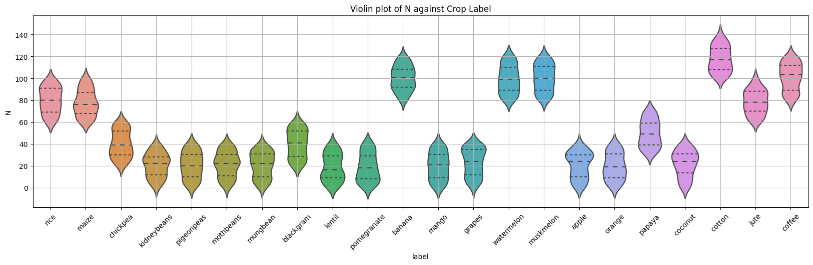
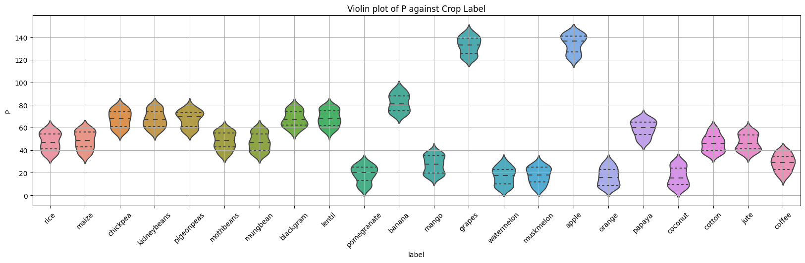
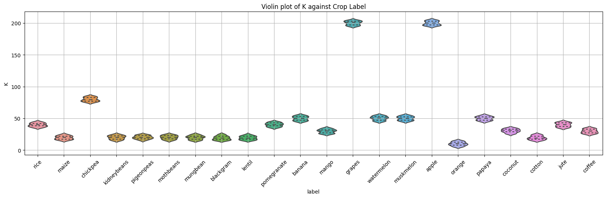
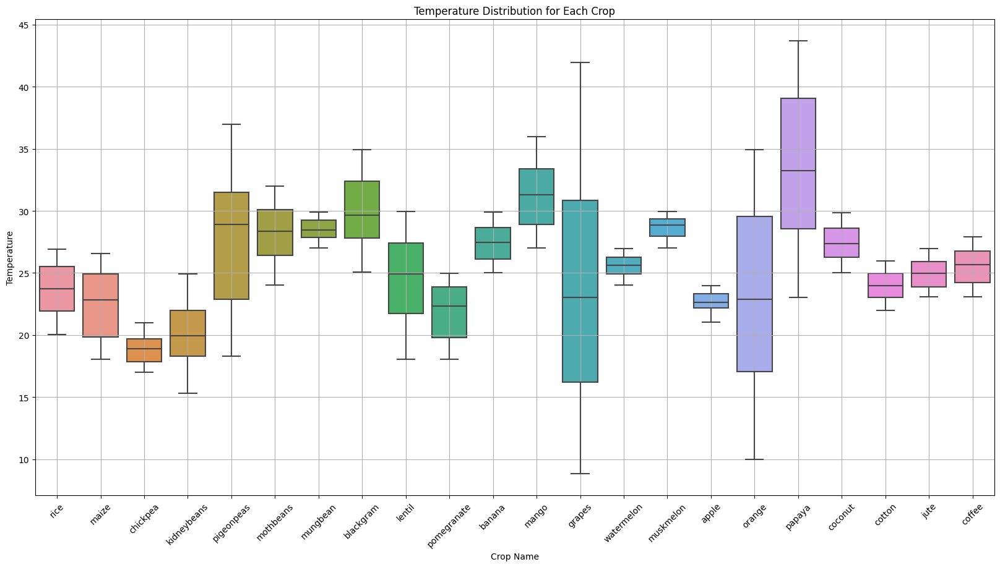
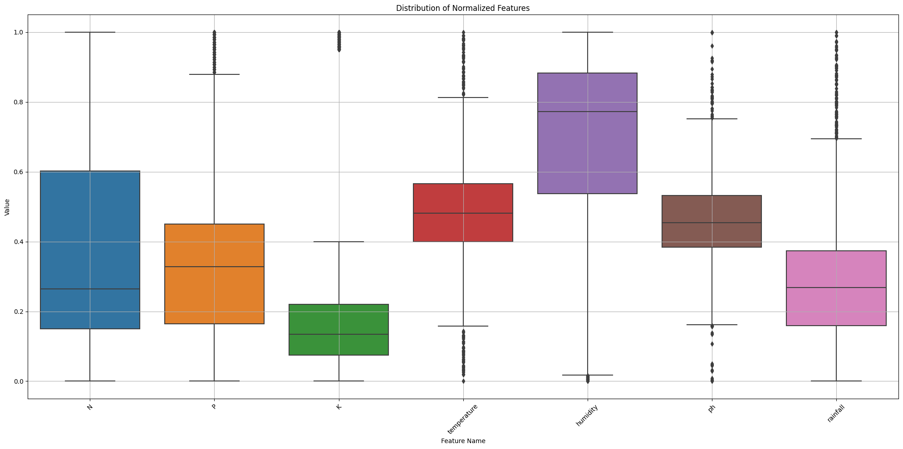

# Overview of Crop Recommendation Dataset Analysis

## Objective

The goal of this project is to dig deeper into the Crop Recommendation Dataset. I will explore various agricultural parameters to understand their effects and relationships with different crops. By doing so, we can form insights on how different environmental and soil conditions might impact the suitability of a crop for a specific region.

## Introduction to the Variables

- **N (ratio of Nitrogen)**: Nitrogen is a primary nutrient for plants as it's a major component of chlorophyll, the compound plants use in photosynthesis. A deficiency can lead to various diseases or stunted growth. 

- **P (ratio of Phosphorus)**: Phosphorus is needed for plant energy transfer. It's vital for the growth of roots and blooming. 

- **K (ratio of Potassium)**: Another major nutrient, potassium is vital for protein- and photo-synthesis.

- **Temperature**: Most crops have a specific temperature range that's conducive for their growth. Too low or high temperatures can lead to reduced yields and/or even crop failure.

- **Humidity**: It's a measure of water vapor present in the air. Some crops thrive in humid conditions, while others prefer a drier atmosphere.

- **pH**: Represents the acidity or alkalinity of the soil. Certain crops flourish in slightly acidic soils, whereas others prefer neutral or slightly alkaline soils.

- **Rainfall**: Water is essential for crop growth, and rainfall amount can determine whether a region is suitable for a particular crop.

- **Label**: This is the crop recommendation, which is the target variable in the dataset. It consists of 22 unique crops.

These values are collected through precision agriculture technology and serve very important factors for each crop.


## Data Exploration

- **Dataset Structure**: The dataset comprises 2,200 entries across 8 distinct columns.
- **Missing Values**: Each column, representing a distinct attribute or factor, is free from missing values.
- **Unique Crops**: The data captures 22 unique crops, with each represented by 100 instances.


```python
import numpy as np
import pandas as pd
import matplotlib.pyplot as plt
import seaborn as sns
from sklearn.preprocessing import MinMaxScaler

df = pd.read_csv('Crop_recommendation.csv')
# Data Inspection
print(df.describe())
print('\n')
print(df.info())

# Check for missing values
print('\n')
print("Missing Values in Dataset")
print(df.isnull().sum())
```

                     N            P            K  temperature     humidity  \
    count  2200.000000  2200.000000  2200.000000  2200.000000  2200.000000   
    mean     50.551818    53.362727    48.149091    25.616244    71.481779   
    std      36.917334    32.985883    50.647931     5.063749    22.263812   
    min       0.000000     5.000000     5.000000     8.825675    14.258040   
    25%      21.000000    28.000000    20.000000    22.769375    60.261953   
    50%      37.000000    51.000000    32.000000    25.598693    80.473146   
    75%      84.250000    68.000000    49.000000    28.561654    89.948771   
    max     140.000000   145.000000   205.000000    43.675493    99.981876   
    
                    ph     rainfall  
    count  2200.000000  2200.000000  
    mean      6.469480   103.463655  
    std       0.773938    54.958389  
    min       3.504752    20.211267  
    25%       5.971693    64.551686  
    50%       6.425045    94.867624  
    75%       6.923643   124.267508  
    max       9.935091   298.560117  
    
    
    <class 'pandas.core.frame.DataFrame'>
    RangeIndex: 2200 entries, 0 to 2199
    Data columns (total 8 columns):
     #   Column       Non-Null Count  Dtype  
    ---  ------       --------------  -----  
     0   N            2200 non-null   int64  
     1   P            2200 non-null   int64  
     2   K            2200 non-null   int64  
     3   temperature  2200 non-null   float64
     4   humidity     2200 non-null   float64
     5   ph           2200 non-null   float64
     6   rainfall     2200 non-null   float64
     7   label        2200 non-null   object 
    dtypes: float64(4), int64(3), object(1)
    memory usage: 137.6+ KB
    None
    
    
    Missing Values in Dataset
    N              0
    P              0
    K              0
    temperature    0
    humidity       0
    ph             0
    rainfall       0
    label          0
    dtype: int64
    


```python
# Display unique crop labels
values, counts = np.unique(df['label'], return_counts=True)
print(f'Number of unique crop labels: {len(values)}')
for (i, j) in zip(values, counts):
    print(f'{i}: {j}')
```

    Number of unique crop labels: 22
    apple: 100
    banana: 100
    blackgram: 100
    chickpea: 100
    coconut: 100
    coffee: 100
    cotton: 100
    grapes: 100
    jute: 100
    kidneybeans: 100
    lentil: 100
    maize: 100
    mango: 100
    mothbeans: 100
    mungbean: 100
    muskmelon: 100
    orange: 100
    papaya: 100
    pigeonpeas: 100
    pomegranate: 100
    rice: 100
    watermelon: 100
    

## Visualization Insights

### Factors Distribution

Violin plots are a powerful tool to depict the distribution of data and its probability density. From the plots, we could discern:
  
- Factors like `N`, `P`, and `K` showcase varying needs across different crops.
- Environmental conditions such as `temperature`, `humidity`, `pH`, and `rainfall` exhibit diverse distributions, suggesting certain crops prefer specific ranges.


### NPK Analysis Results

- From the violin plots below, we can see that the crops that need a lot of **Nitrogen**(more than 80 in soil) are: **rice, maize, cotton, coffee, muskmelon, watermelon, and banana**. 
- Nitrogen variation for each crop is **~40**
- Crops that have lower need for **Nitrogen** are: 
- Crops that have higher requirements for Phosphorous are: apples and grapes
- High requirement of **Phosphorous and Potassium** in soil: **grapes, apple**

You can see that phosphorous requiremenet and potassium requirement are relatively higher than requirement in Nitrogen for this dataset. This is because of its scarcity compared to Nitrogen nutrient. There are more ways to get N than to get P and K. Some plants fixate their own Nitrogen while they don't do the same for P and K. Potassium is significantly higher than Phosphorus because during harvest, Potassium is removed 5-10 times more than Phosphorus and on the same level as Nitrogen. However, the requirement for K is higher than N for grapes and apples. This could be due to mineral weathering of the soil condition. This could be seen in the Temperature graph indicating a higher fluctuation of temperature in grape growth environment. 


```python
nutrients = ['N', 'P', 'K']

for NPK in nutrients:
    plt.figure(figsize=(20,5))
    sns.violinplot(data=df, x='label', y=NPK, inner="quartile")
    plt.xticks(rotation=45)
    plt.grid()
    plt.title(f'Violin plot of {NPK} against Crop Label')
    plt.show()
```


    

    


    

    


    

    


### Temperature Distribution

A histogram was used to understand the distribution of temperature values across the dataset. This visualization can answer questions like:
  
- Are there specific temperature ranges that are predominant?
- Which crops are more tolerant to temperature extremes?

Based on the graphs below, it seems clear that the the predominant temperature ranges from **25 to 30 degrees Celsius**.
And the crops that are tolerant to temperature extreme changes are **papayas, pigeonpeas, grapes and oranges**.
Because the region in which these crop data were collected from doesn't have big fluctuating temperature in its seasons, it's crucial to define temperature extreme as relatively big change in temperature, relative to the usual temperature in the region. 


```python
plt.figure(figsize=(20,10))
sns.boxplot(data=df, x='label', y='temperature')
plt.xticks(rotation=45)
plt.grid()
plt.title('Temperature Distribution for Each Crop')
plt.ylabel('Temperature')
plt.xlabel('Crop Name')
plt.show()

```


    

    


## Data Preprocessing

### Label Encoding

Crop labels were converted from categorical to numerical format to facilitate any subsequent machine learning tasks.

### Feature Scaling

Using `MinMaxScaler`, features were normalized to ensure they are on the same scale, especially vital for machine learning models that rely on distance metrics.

### Distribution of Normalized Features

A box plot provided insights into the distribution of features post-normalization.


From the plot below we can see that:

1) **Distribution Range**: Upon normalization, all the feature values are now within the range [0, 1], as expected. This makes comparisons across features easier and more intuitive.

2) **Features such as N, P, and K**: NPK all have a significant proportion of their data points close to the lower end of their distribution, suggesting that many crops require these nutrients in smaller relative amounts. This could be due to the fact that many soils have inherent fertility for these nutrients, or perhaps many of the crops in the dataset are adapted to lower nutrient conditions.

3) **Temperature**: The temperature has a relatively symmetrical distribution around its median. This suggests that the dataset includes crops that prefer a wide range of temperatures, from cooler to warmer conditions.

4) **Humidity**: The distribution of humidity shows a slight skew towards the higher end. This might indicate that a larger proportion of the crops in the dataset prefer, or at least tolerate, higher humidity conditions.

5) **pH**: The pH has a very symmetrical distribution around its median. This could suggest that the dataset represents a good mix of crops that prefer different soil pH levels, from slightly acidic to slightly alkaline.

6) **Rainfall**: - Rainfall has an extended upper whisker and potential outliers above the upper quartile. This could be indicative of certain crops that are adapted to regions with high rainfall or might even require a lot of water for optimal growth. However, a significant number of crops also seem to thrive in lower rainfall conditions, as seen by the dense concentration of data points towards the lower end.

### Overall Outliers:
- Some features, like rainfall, show potential outliers (data points outside the interquartile range whiskers). These might represent specific crops with unique requirements or could be indicative of specific microenvironments.

### Interquartile Range:
- The interquartile range (the range between the 25th percentile and the 75th percentile, represented by the box's height) for features like temperature and pH is relatively smaller, suggesting that 50% of the data for these features lies within a narrow range. On the other hand, nutrients like N, P, and K have a wider interquartile range, indicating greater variability in the middle 50% of their data.


```python
factors = ['N', 'P', 'K', 'temperature', 'humidity', 'ph', 'rainfall']


# Convert labels to numerical values
label_mapping = {label: idx for idx, label in enumerate(df['label'].unique())}
df['label'] = df['label'].map(label_mapping)

# Split data into features and target
X = df.drop('label', axis=1)
y = df['label']

# Normalize features
scaler = MinMaxScaler()
X = scaler.fit_transform(X)

X_df = pd.DataFrame(X, columns=factors)
# Plotting normalized features
plt.figure(figsize=(20,10))
sns.boxplot(data=X_df)
plt.title('Distribution of Normalized Features')
plt.ylabel('Value')
plt.xlabel('Feature Name')
plt.xticks(rotation=45)
plt.grid(True)
plt.tight_layout()
plt.show()

```


    

    


## Conclusion

The NPK analysis will further delve into the primary nutrients required for plant growth and how they vary across different crops.

Further research and advanced analytics, such as predictive modeling, can leverage this preliminary analysis to recommend specific crops for given environmental and soil conditions.


```python

```
