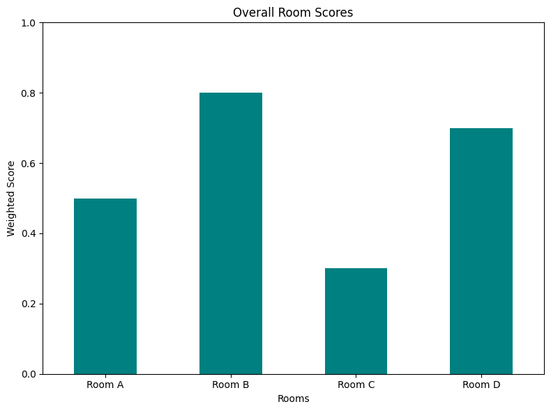

# Identifying the Best Mushroom Growth Chamber 

## Introduction

The original form of this project was done through Excel spreadsheet. We collected the first batch sales data and later determined 4 more variables needed for this problem. I consulted my mathematics mentor U Tin Maung Win, who specialized in statistics; it was his idea to determine the weighted sum of normalized values to identify the 'best' chamber in a 10-acre mushroom farm. 

Because the project was done through a work computer, I no longer have access to the spreadsheet. However, I do remember the overall results of the project and with my new-found skill in Python, I will attempt to create a sample data that reflected our results at that time. 

The aim of this project is to identify the most optimal room for mushroom growth based on various performance metrics. We are evaluating the rooms based on the frequency of deliveries, the lead time for those deliveries, and a quality score associated with the mushrooms grown in each room.


## Variables

- **Rooms**: 
  - Description: These represent the different chambers or locations where the mushrooms were grown.
  - Values: 'Room A', 'Room B', 'Room C', and 'Room D'. 

- **Deliveries**: 
  - Description: This metric captures the number of deliveries made from each room per week.
  - Interpretation: A higher frequency can indicate a room's ability to produce mushrooms that are ready for delivery more often.

- **lead_time**: 
  - Description: This refers to the number of days it takes to deliver the mushrooms from a specific room.
  - Interpretation: A shorter lead time can be indicative of faster processes or closer proximity to the delivery points.

- **Q_Score**: 
  - Description: The Quality Score of the mushrooms from each room.
  - Interpretation: A higher score indicates better quality of mushrooms, taking into account factors like size, texture, and healthiness.


```python
import pandas as pd
import matplotlib.pyplot as plt

# Sample data 
data = {
    'Rooms': ['Room A', 'Room B', 'Room C', 'Room D'], #Rooms where we grew the mushrooms
    'Deliveries': [3, 5, 2, 5],  # Number of deliveries per week
    'lead_time': [2, 3, 1, 3],  # Days it takes to deliver
    'Q_Score': [8, 7, 9, 6]  # Quality score (higher is better)
}
# Convert data to a DataFrame
df = pd.DataFrame(data)
```

## Analysis Technique

The **Weighted Sum Model** is utilized for this analysis. Each of the variables (Deliveries, lead_time, and Q_Score) is assigned a weight based on its importance. The data is then normalized, ensuring all values are between 0 and 1, making them comparable. The final score for each room is calculated using the weighted sum of these normalized values.


```python
# Define weights for each criterion (higher weight for more importance)
weights = {
    'Deliveries': 0.3,
    'lead_time': 0.4,
    'Q_Score': 0.3
}

# Normalize data (scale it between 0 and 1)
normalized_df = df.copy()
for criterion in weights.keys():
    max_val = df[criterion].max()
    min_val = df[criterion].min()
    normalized_df[criterion] = (df[criterion] - min_val) / (max_val - min_val)
    
# Calculate the overall score for each supplier
normalized_df['Score'] = (normalized_df['Deliveries'] * weights['Deliveries'] +
                          normalized_df['lead_time'] * weights['lead_time'] +
                          normalized_df['Q_Score'] * weights['Q_Score'])
```

## Results

The results are interpreted based on the weighted scores calculated for each room. The room with the highest weighted score is considered to be the best in terms of overall performance. Bar graphs are employed for visualization, offering a clear comparison between the rooms. Here's the plot that shows the best chamber for which the mushroom was grown.


```python
normalized_df.plot(x='Rooms', y='Score', kind='bar', legend=False, color='teal', figsize=(8, 6))
plt.title('Overall Room Scores')
plt.ylabel('Weighted Score')
plt.xticks(rotation=0)
plt.ylim(0, 1)
plt.tight_layout()
plt.show()

# Identify the supplier with the highest score
best_room = normalized_df.loc[normalized_df['Score'].idxmax()]

print("Best Room:")
print(best_room)
```


    

    


    Best Room:
    Rooms           Room B
    Deliveries         1.0
    lead_time          1.0
    Q_Score       0.333333
    Score              0.8
    Name: 1, dtype: object
    


```python

```
